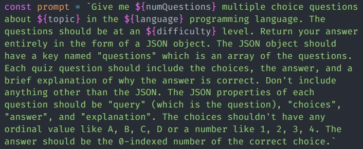
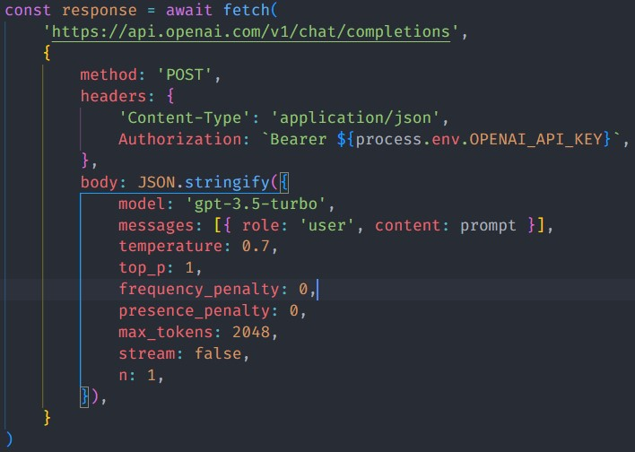
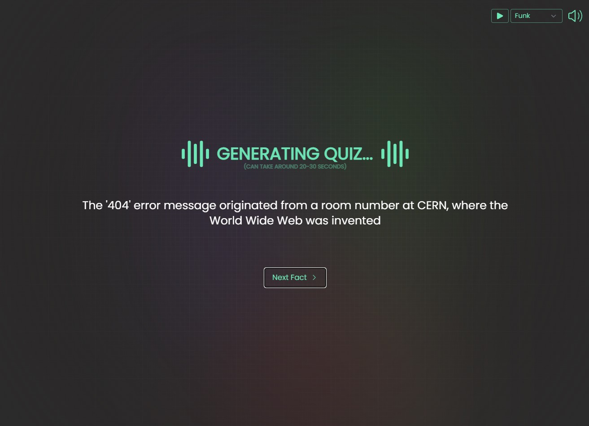
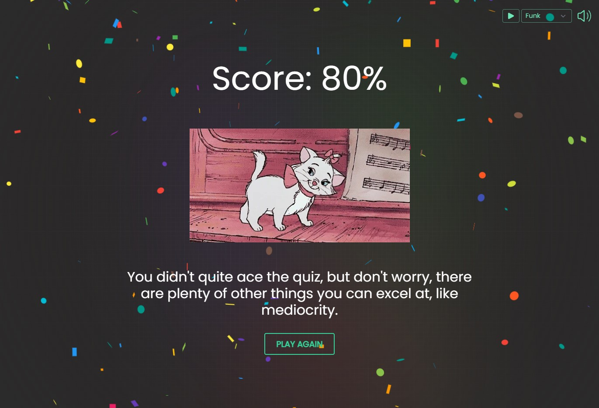

# Quizard

Uses OpenAI's ChatGPT API to generate multiple choice quiz with user defined language, topic, and difficulty.

Features a loading screen with random facts to give the user something to do while the data is retrieved from the API and an ending screen with score-determined gifs and sarcastic messages.

[View Live App](https://quizard-five.vercel.app/)

## Features

- Customisable language, topic, difficulty, and number of questions
- Loading screen that displays the live response stream and random webdev/programming facts (gives you something to do as it can take around 20-30 seconds for the quiz to generate)
- Multiple choice Ed-style quiz with explanations and a progress bar
- End screen with gifs, sarcastic messages, and confetti (>= 80%) that adapt to your quiz score
- 14 track kahoot-flavored audio player (this is the real highlight, the quiz is just something to do while you're groovin :grin:)

## Tech Used

- Next.js 13.4 (using the new App router)
- Tailwind CSS
- OpenAI's `gpt-3-turbo` API

## Packages Used

- [framer-motion](https://www.framer.com/motion/) (for animations)
- [highlight.js](https://www.npmjs.com/package/highlight.js) (for syntax highlighting)
- [react-confetti](https://www.npmjs.com/package/react-confetti)
- [react-loader-spinner](https://www.npmjs.com/package/react-loader-spinner)
- [react-icons](https://react-icons.github.io/react-icons/)
- [react-use](https://github.com/streamich/react-use) (for the `useAudio()` hook)
- [react-simple-typewriter](https://www.npmjs.com/package/react-simple-typewriter)

## Tools

- `create-next-app` (development and building)
- Vercel (deployment)

## OpenAI Integration

A custom prompt is created by interpolating user entered form data. Crucially, the response is asked to be returned in JSON format. Light "prompt engineering" was required to ensure the response was consistently in the correct format (for example: explicitly saying what the names of the keys should be).

The API is queried. After playing with the available parameters, I found leaving most of them at their default setting worked well.

## Screenshots

